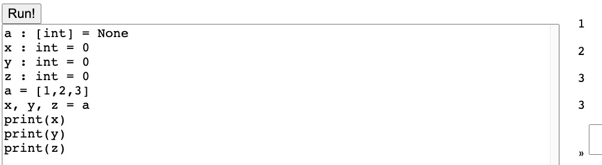
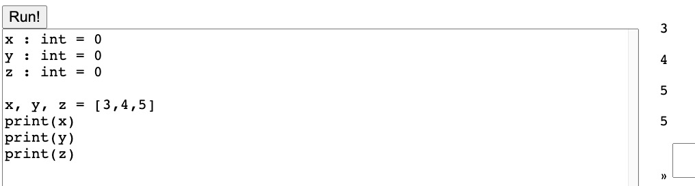
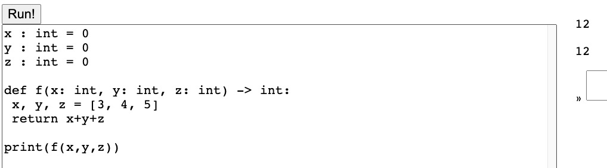
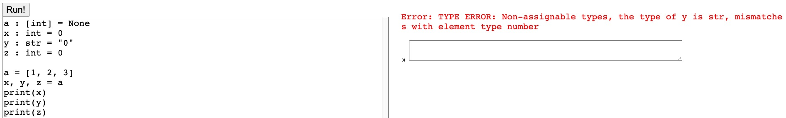
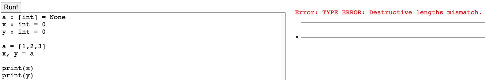
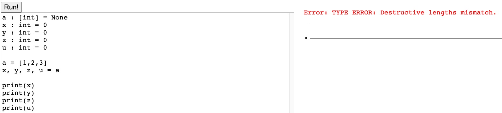

#Fixed-length Destructuring Assignment for Lists
### Task
Describe how you would add destructuring assignment just for lists, and just for fixed-length destructuring, to your compiler (e.g. a = [1,2,3]; x, y, z = a)

### Implementation Link
https://github.com/ridiculousJoe/cse231-final/tree/f_destructive
### Expected Behavior
+ basic function as description:
```typescript
assertPrint("destructive-assign-basic",
        `
a : [int] = None
x : int = 0
y : int = 0
z : int = 0
a = [1,2,3]
x, y, z = a
print(x)
print(y)
print(z)`, ["1", "2", "3"]
    );
```
+ destructuring assgin raw list:
```typescript
assertPrint("destructive-raw-list",
        `
x : int = 0
y : int = 0
z : int = 0

x, y, z = [1,2,3]
print(x)
print(y)
print(z)`, ["1", "2", "3"]
    );
```
+ use in function:
```typescript
assertPrint("destructive-in-function",
        `
x : int = 0
y : int = 0
z : int = 0

def f(x: int, y: int, z: int) -> int:
 x, y, z = [3, 4, 5]
 return x+y+z

print(f(x,y,z))`, ["12"]
```
+ check assignability
```typescript
assertTCFail("mismatch-id-list-type", `
a : [int] = None
x : int = 0
y : str = "0"
z : int = 0

a = [1, 2, 3]
x, y, z = a
print(x)
print(y)
print(z) 
`);
```
+ check fixed-length, that is the length of left side matches with the right side
```typescript
assertTCFail("left-shorter-than-right", `
a : [int] = None
x : int = 0
y : int = 0

a = [1,2,3]
x, y = a

print(x)
print(y)
`);
assertTCFail("left-longer-than-right", `
a : [int] = None
x : int = 0
y : int = 0
z : int = 0
u : int = 0

a = [1,2,3]
x, y, z, u = a

print(x)
print(y)
print(z)
print(u)
`);
```

### Components of the compiler that would need to be changed
#### ast.ts
I added a new statement "destructive-assign" to the ast.ts:
```typescript
{  a?: A, tag: "destructive-assign", names: Array<string>, iterable: Expr<A>}
```
the names contain all the ids in the left hand, and the iterable represent the list to be destructuring assigned
#### parser.ts
```typescript
case "AssignStatement":
      c.firstChild(); // go to name
      var target = traverseExpr(c, s);
      c.nextSibling(); // go to equals or comma
      if(c.type.name === ",") {
        var names : Array<string> = [];
        if(target.tag !== "id") throw new Error("Destructive assignment only support ids now.")
        names.push(target.name);
        // @ts-ignore
        while(c.type.name !== "AssignOp") {
          if(c.type.name !== ",") {
            names.push(s.substring(c.from, c.to))
          }
          c.nextSibling();
        }
        c.nextSibling(); // go to value
        var value = traverseExpr(c, s);
        c.parent();
        return {
          tag: "destructive-assign",
          names: names,
          iterable: value
        }
      }

      c.nextSibling(); // go to value
```
I add the additional logic to parse destructive-assign if we find comma in the left hand
#### type-check.ts
```typescript
case "destructive-assign":
      const tIterableExpr = tcExpr(env, locals, stmt.iterable);
      if(tIterableExpr.a.tag !== "list") throw new TypeCheckError("Destructive assignment can only support list currently")
      if(tIterableExpr.a.listsize !== stmt.names.length) throw new TypeCheckError("Destructive lengths mismatch.")
      const objType = tIterableExpr.a.elementtype;
      stmt.names.forEach((name, idx) => {
        var nameTyp;
        if (locals.vars.has(name)) {
          nameTyp = locals.vars.get(name);
        } else if (env.globals.has(name)) {
          nameTyp = env.globals.get(name);
        } else {
          throw new TypeCheckError("Unbound id: " + name);
        }
        if(!isAssignable(env, objType, nameTyp))
          throw new TypeCheckError(`Non-assignable types, the type of ${name} is ${nameTyp.tag}, mismatches with element type ${objType.tag}`)
      });
      return {a: NONE, tag: stmt.tag, names: stmt.names, iterable: tIterableExpr};
```
This logic was added to the "tcStmt" function. I first check if the iterable expression is a list, then I check whether the lengths of both sides match with each other.
If the lengths match, we check the type of each left variable with the object type of the list.
#### lower.ts
```typescript
case "destructive-assign":
      if(s.iterable.a.tag !== "list") throw new Error("Compiler is cursed, go home.")
      const elementType = s.iterable.a.elementtype;
      var valinits : Array<IR.VarInit<Type>> = [];
      s.names.forEach((name, idx) => {
        var element : AST.Expr<Type> = {a: elementType, tag: "index", obj: s.iterable, index: PyLiteralExpr(PyInt(idx))};
        var assignStmt : AST.Stmt<Type> = {  a: NONE, tag: "assign", name: name, value: element };
        var inits = flattenStmt(assignStmt, blocks, env);
        valinits.push(...inits);
      });
      return valinits
```
I finished the implementation in lower.ts level. The above logic was added to "flattenStmt" function.
The logic is pretty straightforward. I just expand the destructive-assign to many single assign statements, and then reuse the logic for flattening assign statement.

### Test Results








You can also run
```shell
npm run test
```
I added all the test cases to the test folder

### Extension
The current implementation only support ids for the left-hand side.
It currently can not support field lookup and list index as the left-hand variables, or a mixture of these three kinds of assignment(id, lookup, index).
If we want to support the other two types, we need to change the "destructive-assign" a little.
Instead of just using a simple "names" field, we need specify which type of assignment it is.
Like:
```typescript
export type AssignVar = {name: string, assigntype: string}
{  a?: A, tag: "destructive-assign", names: Array<AssignVar>, iterable: Expr<A>}
```
Of course, this structure is not enough, to handle the later compilation of lookup and list index, the AssginVar need to contain more information.
Thus, in the lower.ts level, we can build different statements for the expanded "destructive-assign" based on their assign type.